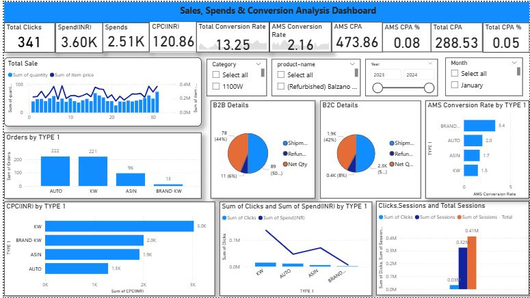

# -Sales-Spends-Conversion-Analysis-Dashboard

## 📌 Project Overview

This project focuses on analyzing the given dataset using Power BI to identify important trends, patterns, and performance indicators.
The primary goal of the project is to transform raw data into meaningful insights that support informed business decisions.

## 🔍 Data Cleaning & Preparation

Before building the dashboard, the dataset was cleaned and transformed to ensure accuracy and consistency.
Key steps included:

**🔹 Data Import**

Loaded data from the provided files into Power BI.

Verified table structure and field types.

**🔹 Data Cleaning**

Removed duplicate rows.

Handled missing values using replacement, filtering, or imputation.

Standardized date formats and corrected incorrect data types.

Cleaned text fields (trim, proper case, remove whitespaces).

**🔹 Data Transformation**

Split and merged columns where needed.

Created calculated columns for improved readability.

Performed aggregation and grouping for summary metrics.

**🔹 Data Modeling**

Built a proper relationship model between tables.

Ensured star schema–friendly structure.

Set cardinality and cross-filtering directions.

Created Date Table for time intelligence.

**🔹 DAX Measures**

Common measures created:

Total Sales

Total Quantity

Total Profit

Profit Margin %

Year-over-Year Growth

Monthly Trend Measures

---

## 📊 Dashboard Features

**✨ Key Features**

KPI Cards: Highlight overall Sales, Profit, Quantity, and Growth.

Trend Analysis Line Charts: Monthly and yearly performance trends.

Bar/Column Charts: Product-wise, category-wise, or region-wise performance.

Pie & Donut Charts: Share contribution of each segment.

Maps (if applicable): Geographic sales insights.

Drill-Down & Drill-Through: Detailed view of product, customer, or region.

Filters & Slicers: Year, month, category, region, customer type, etc.

Interactive Buttons: Page navigation or tooltips.

---

## 📈 Key Insights & Analysis

**📌 Sales Insights**

Identified peak sales months and low-performing periods.

Found which years/quarters contributed highest to revenue.

Observed seasonality or demand fluctuations.

**📌 Product Insights**

Top-performing products/categories.

Products with declining or inconsistent trends.

High-profit vs low-profit items.

**📌 Customer Insights**

Key customer segments generating the largest revenue.

Customer purchase behavior patterns.

Retention and repeat purchase trends.

**📌 Geographic Insights (if applicable)**

High-performing states/regions.

Regions needing attention due to lower sales.

**📌 Profitability Insights**

Products with high sales but low profit margins.

Profit vs quantity mismatch areas.

Areas to reduce cost or optimize pricing.

---

## 💡 Business Recommendations

**⭐ Sales & Marketing Suggestions**

Run targeted promotions during low-performing months.

Encourage cross-selling using frequently bought-together product analysis.

Personalized campaigns for high-value customers.

**⭐ Operational Recommendations**

Optimize supply chain for products with inconsistent availability.

Reduce unnecessary costs in low-margin categories.

---

## 🧠 Project Motivation

The motivation behind choosing this project was to enhance analytical skills using real-world data and learn how business intelligence tools help organizations make data-driven decisions.
This project helped in improving:

Data cleaning and transformation skills

Dashboard designing

DAX formula writing

Data storytelling

Business understanding

---
## 🛠️ Technology Stack

- **Power BI Desktop (.pbix)**
- **Power Query Editor** for ETL
- **DAX (Data Analysis Expressions)** for measures & KPIs
- **Data Sources:** Adventure Works DW (Excel/CSV or SQL-based)

---

## 📎 Screenshots
**Dashboard**

  

 

**Schema**

  

 

---

**✅ Conclusion**
This Power BI project successfully transforms raw data into meaningful business insights.
Through interactive dashboards, the analysis highlights sales performance, key products, customer behavior, and profitability trends.
The findings help identify strengths, weaknesses, and opportunities for improvement.
Overall, this project showcases strong analytical, technical, and data visualization skills, making it a valuable addition to a data analyst portfolio.

